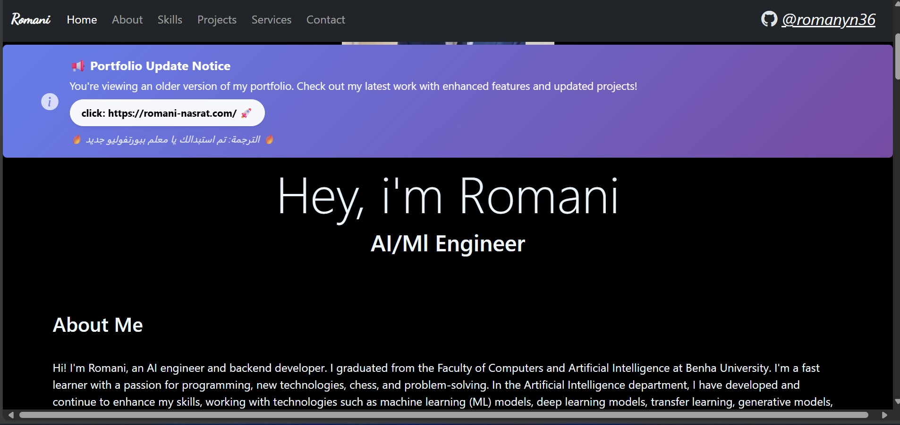

# 🚨 NOTICE: This is an Old Version of My Portfolio

> **⚠️ This repository contains an older version of my portfolio website. For the latest and most up-to-date version with enhanced features, improved design, and recent projects, please visit:**
> 
> ## 🆕 **[click: https://romani-nasrat.com/](https://romani-nasrat.com/)**
> 
> The new portfolio includes:
> - ✨ Modern design and improved UX
> - 🚀 Latest projects and achievements
> - 📱 Better mobile responsiveness
> - ⚡ Enhanced performance
> - 🎨 Updated styling and animations
> 
> ---

# Romani's Portfolio Website (Legacy Version)



A modern, responsive portfolio website showcasing AI/ML engineering skills, projects, and services. Built with HTML5, CSS3, JavaScript, and Bootstrap 5.
this porfolio was a Task in <a href="https://iti.gov.eg/home">ITI (Information Technology Institute)</a> React Frontend summer training program. July-September 2023 [My LinkedIn Post && Certificate](https://www.linkedin.com/posts/romaninasrat_iti-reactjs-webdevelopment-activity-7152040841430085632-MElc?utm_source=share&utm_medium=member_desktop&rcm=ACoAADTAWeoBxeAsC30Uc_6GRX96ZvPK7k6MGbw)  


## 🚀 Live Demo

Visit the live website: [Portfolio Website (Legacy)](https://romanyn36.github.io/portfolio.github.io/)

**🔗 For the latest version, visit: [romani-nasrat.com](https://romani-nasrat.com/)**

## 🌟 Features

- **Responsive Design**: Fully responsive layout that works on desktop, tablet, and mobile devices
- **Interactive Skills Section**: Animated skill bars with intersection observer for smooth animations
- **Project Showcase**: Display of various AI/ML and web development projects with tooltips
- **Services Section**: Accordion-style presentation of offered services
- **Client Reviews**: Dynamic carousel displaying client testimonials
- **Contact Information**: Easy-to-find contact details and social media links
- **Modern UI**: Dark theme with glassmorphism effects and smooth animations


## 📁 Project Structure

```
portfolio.github.io/
├── index.html              # Main HTML file
├── skills.css             # Skills section styling
├── skills.js              # Skills animation logic
├── css/
│   └── main.css           # Main stylesheet
├── favicon_io/            # Favicon files
│   ├── favicon.ico
│   ├── apple-touch-icon.png
│   └── site.webmanifest
├── images/                # Image assets
│   ├── me1.jpg           # Profile image
│   ├── projects/         # Project screenshots
│   ├── reviews/          # Review images (desktop)
│   └── mobile/           # Review images (mobile)
└── README.md             # Project documentation
```

## 🛠️ Technologies Used

- **HTML5**: Semantic markup structure
- **CSS3**: Modern styling with animations and glassmorphism effects
- **JavaScript (ES6+)**: Interactive functionality and DOM manipulation
- **Bootstrap 5**: Responsive grid system and components
- **Bootstrap Icons**: Icon library for UI elements
- **Google Fonts**: Poppins and Dancing Script font families

## 📱 Sections

### 1. Navigation
- Fixed navigation bar with smooth scrolling to sections
- GitHub profile link
- Responsive mobile menu

### 2. Home/Hero
- Professional profile image
- Introduction and title
- Clean, centered layout

### 3. About
- Personal background and expertise
- Educational information
- Technical skills overview

### 4. Skills
- **AI/ML Skills**: Deep Learning, Machine Learning, Transformers, Generative Models
- **Backend Development**: Django, Flask, RESTful APIs, MySQL, SQLite
- **Web Development**: HTML, CSS, JavaScript, React.js, Bootstrap
- Animated progress bars with intersection observer
- Programming languages and tools icons

### 5. Projects
Featured projects include:
- **Catch The AI**: AI-generated media detection system
- **Breast Cancer Detection System**: Deep learning medical diagnosis
- **E-Learning Platform**: Django-based educational platform
- **ChatBot with NLP**: Natural language processing chatbot
- **Blood Bank Management System**: Hospital management system
- **Smart Attendance System**: Face recognition attendance
- **Chest X-ray Classification**: Medical image classification

### 6. Services
- AI model development
- Web development
- Backend integration
- App development
- Detailed service descriptions in accordion format

### 7. Client Reviews
- Dynamic carousel with 21+ client testimonials
- Responsive images for desktop and mobile
- Auto-generated carousel indicators

### 8. Contact
- Location, phone, and email information
- Social media links
- Professional contact form (hidden by default)

### 9. Footer
- Brand information
- Quick navigation links
- Social media profiles
- Copyright information

## 🎨 Key Features Implementation

### Animated Skills Bars
```javascript
// Intersection Observer for skill animations
const observer = new IntersectionObserver(entries => {
    entries.forEach(entry => {
        if (entry.isIntersecting) {
            span.classList.add('animate');
            percentage.classList.add('animate');
        }
    });
});
```

### Dynamic Review Carousel
```javascript
// Auto-generated carousel items
for (let i = 0; i < 21; i++) {
    // Creates carousel indicators and items dynamically
    // Supports both desktop and mobile image versions
}
```

### Glassmorphism Effect
```css
.skills-container {
    background: rgba(255, 255, 255, 0.1);
    backdrop-filter: blur(20px);
    border-radius: 10px;
}
```

## 📱 Responsive Design

- **Desktop**: Full layout with side-by-side skill sections
- **Tablet**: Stacked layout with adjusted spacing
- **Mobile**: Single column layout with optimized images and typography

### Media Queries
```css
@media(max-width: 567px) {
    /* Mobile-specific styles */
    .customcard { margin: 5px; }
    .profileimg { width: 50%; height: 50%; }
    .reviewscontainer { width: 100%; }
}
```

## 🚀 Getting Started

1. **Clone the repository**
   ```bash
   git clone https://github.com/romanyn36/portfolio.github.io.git
   ```

2. **Navigate to project directory**
   ```bash
   cd portfolio.github.io
   ```

3. **Open in browser**
   ```bash
   # Open index.html in your preferred browser
   open index.html
   ```

## 🔧 Customization

### Adding New Projects
1. Add project images to `images/projects/`
2. Update the projects section in `index.html`
3. Add appropriate tooltips and links

### Modifying Skills
1. Update skill percentages in `skills.css`
2. Modify skill names and categories in `index.html`
3. Adjust animation keyframes if needed

### Changing Theme Colors
```css
/* Primary color scheme */
:root {
    --primary-color: #5271ff;
    --secondary-color: #475472;
    --background-color: black;
    --text-color: aliceblue;
}
```

## 📈 Performance Optimizations

- **Lazy Loading**: Images load as needed
- **CDN Resources**: Bootstrap and fonts loaded from CDN
- **Optimized Images**: Compressed project images
- **Minimal JavaScript**: Lightweight, vanilla JS implementation
- **CSS Animations**: Hardware-accelerated transitions

## 🌐 Browser Compatibility

- ✅ Chrome (latest)
- ✅ Firefox (latest)
- ✅ Safari (latest)
- ✅ Edge (latest)
- ✅ Mobile browsers (iOS Safari, Chrome Mobile)

## 📄 License

This project is open source and available under the [MIT License](LICENSE).

## 👤 Author

**Romani Nasrat**
- 🎓 AI/ML Engineer
- 🌍 Cairo, Egypt
- 📧 romani.nasrat@gmail.com
- 🐙 GitHub: [@romanyn36](https://github.com/romanyn36)
- 💼 LinkedIn: [romanyn36](https://www.linkedin.com/in/romaninasrat/)
- 🌐 **New Portfolio**: [romani-nasrat.com](https://romani-nasrat.com/)

## 🤝 Contributing

**Note**: This is a legacy version. For contributing to the latest version, please visit the new portfolio repository.

1. Fork the repository
2. Create a feature branch (`git checkout -b feature/AmazingFeature`)
3. Commit your changes (`git commit -m 'Add some AmazingFeature'`)
4. Push to the branch (`git push origin feature/AmazingFeature`)
5. Open a Pull Request

## 📞 Contact & Support

For questions, suggestions, or collaboration opportunities:
- 📧 Email: romani.nasrat@gmail.com
- 🐙 GitHub Issues: [Create an issue](https://github.com/romanyn36/portfolio.github.io/issues)
- 💬 Social Media: Available on all major platforms [@romanyn36]
- 🌐 **Latest Portfolio**: [romani-nasrat.com](https://romani-nasrat.com/)

---

## 🔄 Migration Notice

This repository is maintained for reference and legacy purposes. All active development and updates are now focused on the new portfolio at [romani-nasrat.com](https://romani-nasrat.com/).

---

⭐ **If you found this portfolio inspiring, please give it a star!** ⭐

**🆕 Don't forget to check out my [new portfolio](https://romani-nasrat.com/) for the latest updates!**